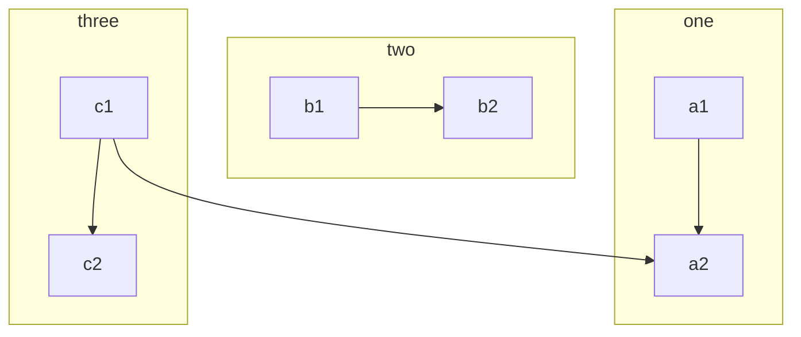

#漂移板练习目标
* 左进正向逆时针180度（完成）
* 左进反向顺时针180度
* 右进正向顺时针180度（完成）
* 右进反向逆时针180度
* 左进右脚前交叉脱板后踩板
* 左进右肢后交叉脱板后踩板
* 右进左脚前交叉脱板后踩板
* 右进左脚后交叉脱板后踩板
* 左进正向360度
* 右进正向360度

```mermaid
	graph TB
    c1-->a2
    subgraph one
    a1-->a2
    end
    subgraph two
    b1-->b2
    end
    subgraph three
    c1-->c2
    end
```